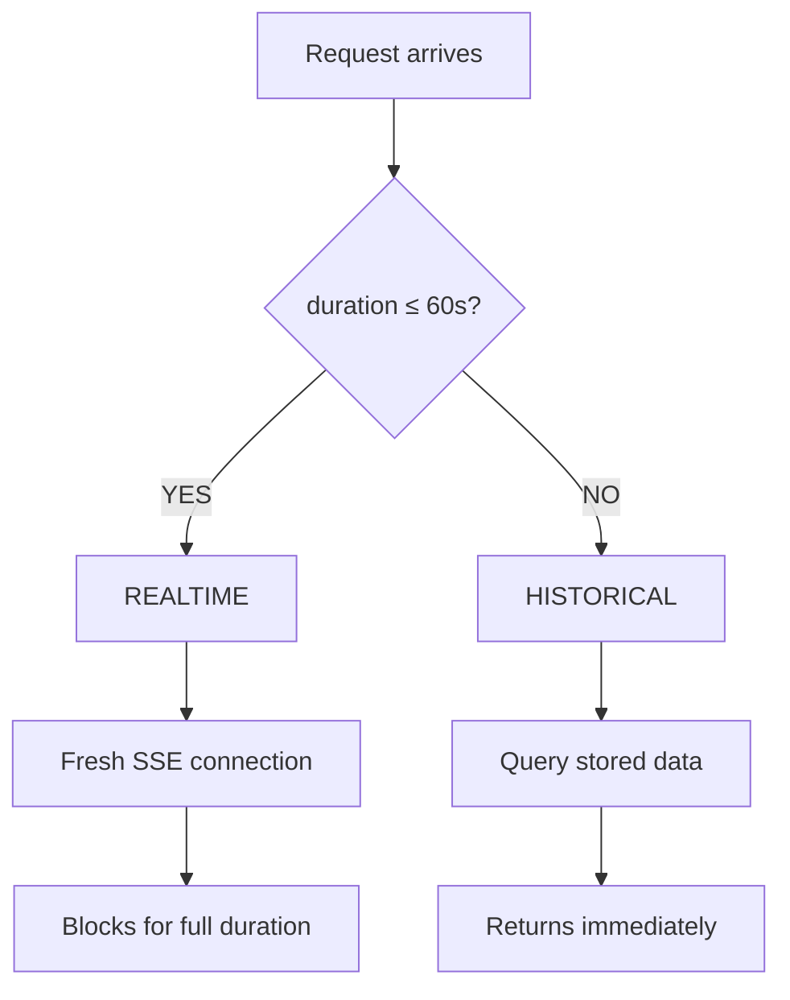
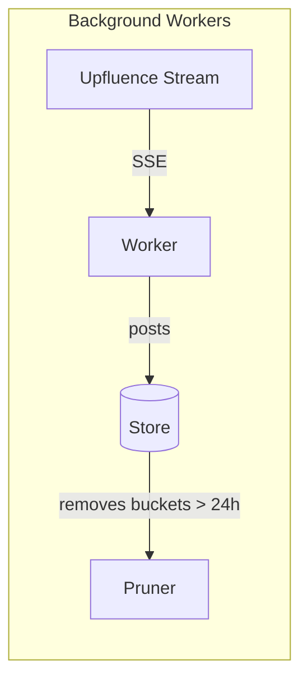
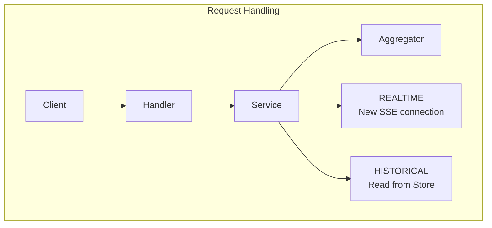
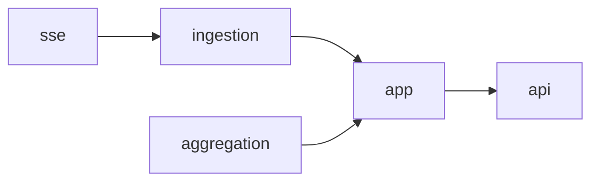
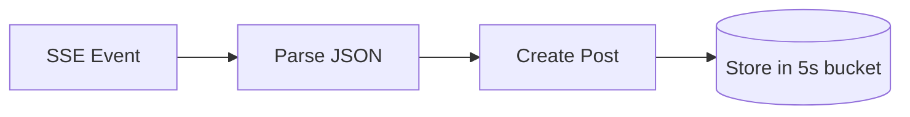
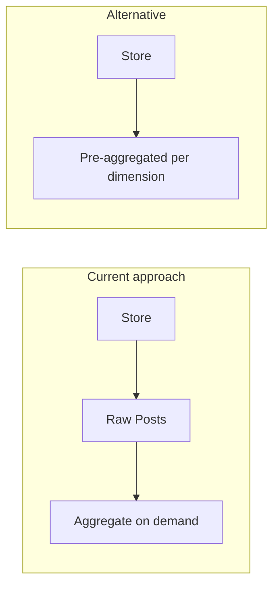
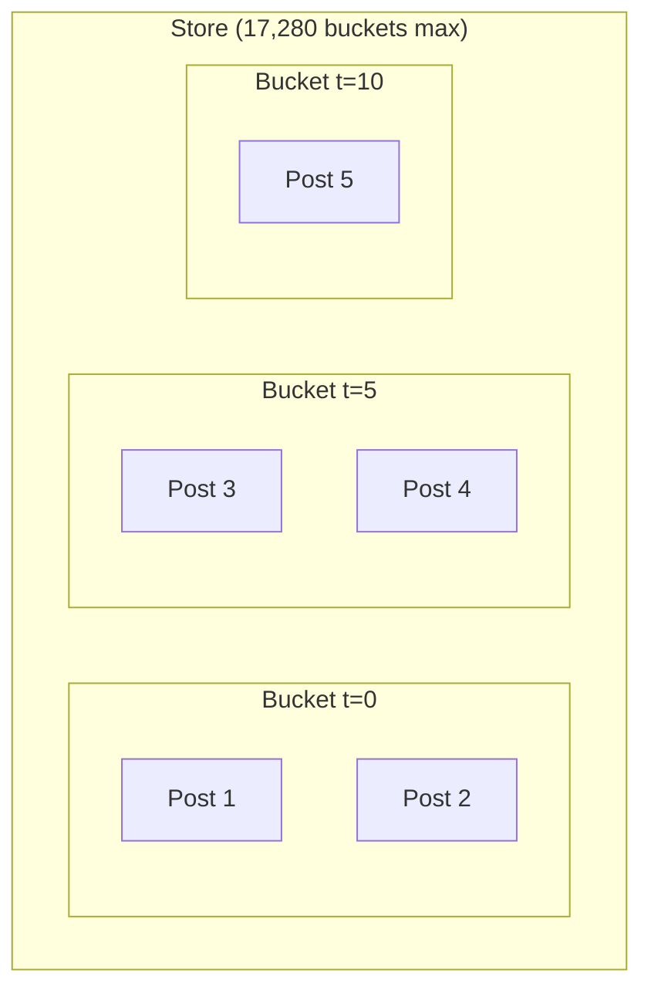
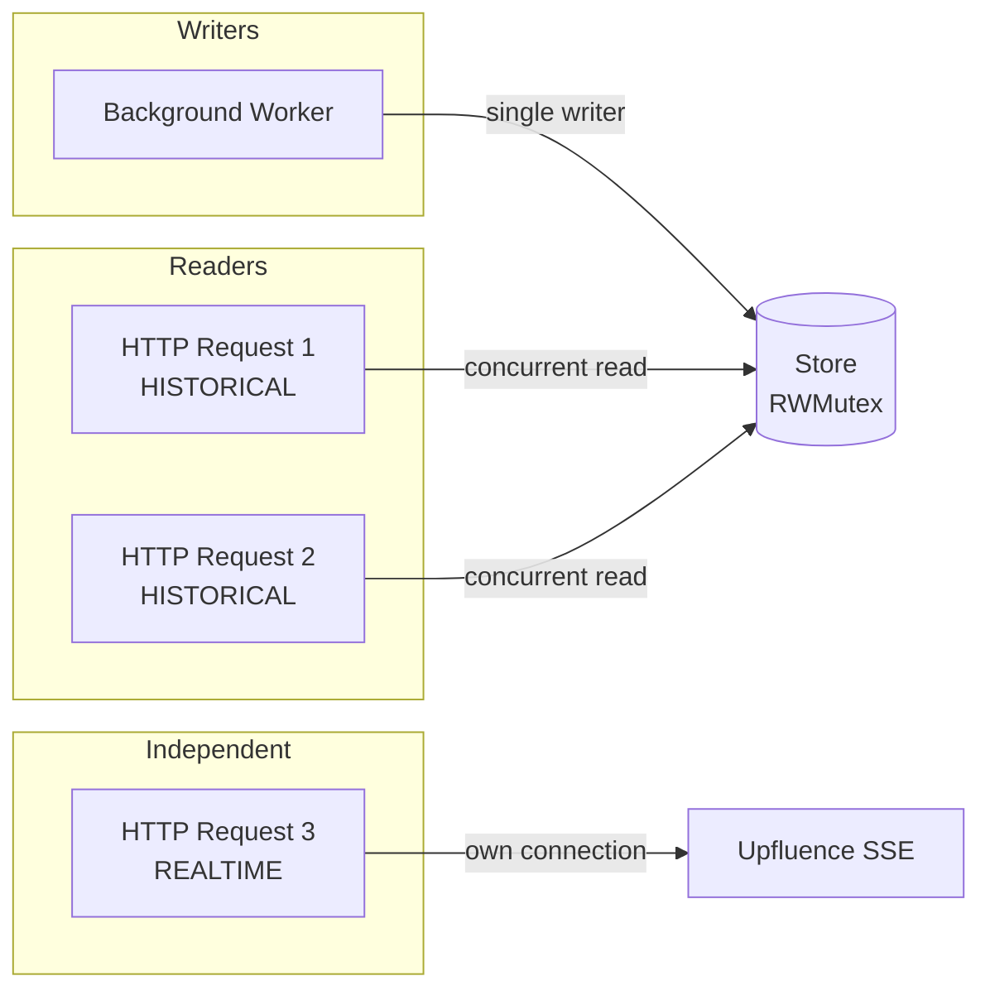
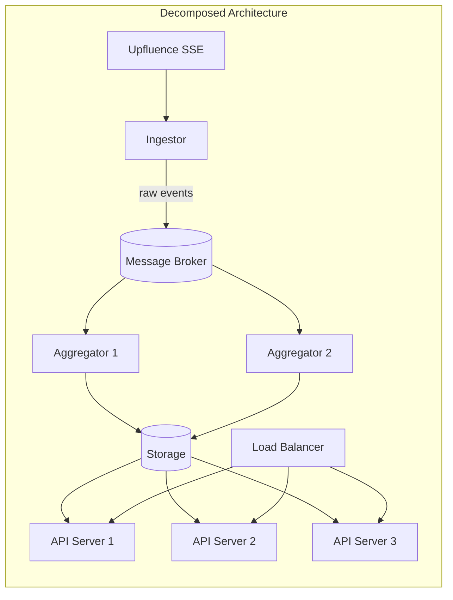
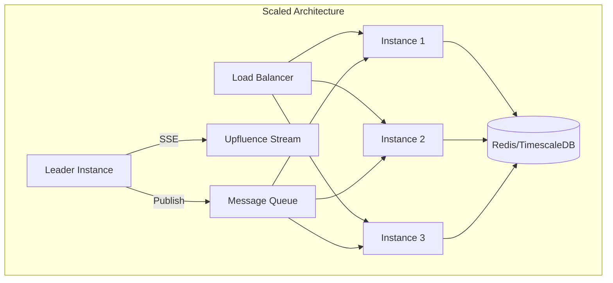

# Upfluence SSE Stream Analyzer

HTTP API that consumes the Upfluence SSE stream and computes P50/P90/P99 percentiles for engagement metrics.

---

## Context

This project is a solution to the [Upfluence Backend Challenge](docs/challenge-guidelines.md). The goal is to build an HTTP service that:

- Consumes a Server-Sent Events (SSE) stream of social media posts
- Computes percentile statistics (P50, P90, P99) for engagement metrics
- Returns results for a specified time window and dimension

**Constraints:** Go standard library only, no external dependencies.

---

## Table of Contents

- [Project Structure](#project-structure)
- [Technical Overview](#technical-overview)
- [API Reference](#api-reference)
- [Architecture](#architecture)
- [How It Works](#how-it-works)
- [Design Decisions](#design-decisions)
- [Technical Details](#technical-details)
- [Getting Started](#getting-started)
- [Testing](#testing)
- [Future Improvements](#future-improvements)

---

## Project Structure

```
cmd/server/main.go           Entry point, HTTP server setup, graceful shutdown

internal/
  model/
    post.go                  Domain types: Post, Metrics
    parser.go                JSON parsing from SSE events
    request.go               API request/response structures

  sse/
    client.go                HTTP client for SSE streams
    parser.go                SSE event format parsing

  ingestion/
    store.go                 Time-bucketed post storage (5s buckets, 24h retention)
    collector.go             SSE consumption and post extraction

  aggregation/
    aggregation.go           Percentile calculation (P50, P90, P99)

  api/
    handler.go               HTTP request handling and validation
    errors.go                Error types and messages

  app/
    service.go               Business logic orchestration

  worker/
    worker.go                Background SSE collection
    pruner.go                Expired data cleanup

docs/
  challenge-guidelines.md    Original challenge specification

openapi.yaml                 API specification (OpenAPI 3.0)
```

---

## Technical Overview

The service operates in two modes depending on the requested duration:

| Duration     | Mode           | Behavior                                                                         |
| ------------ | -------------- | -------------------------------------------------------------------------------- |
| ≤ 60 seconds | **REALTIME**   | Opens a fresh SSE connection, blocks for the full duration, returns exact window |
| > 60 seconds | **HISTORICAL** | Queries pre-collected data from storage, returns immediately                     |



**Why two modes?** The spec says requests should block for the requested duration. Fine for 30 seconds, but 10 minutes? 24 hours? Browsers timeout, proxies drop idle connections, load balancers give up after ~60s. So: blocking for short requests, immediate response for longer ones.

---

## API Reference

### Endpoint

```
GET /analysis
```

### Parameters

| Parameter   | Required | Format                           | Description                                     |
| ----------- | -------- | -------------------------------- | ----------------------------------------------- |
| `duration`  | Yes      | Go duration (`30s`, `5m`, `24h`) | Time window. Min: 5s, Max: 24h                  |
| `dimension` | Yes      | String                           | `likes`, `comments`, `favorites`, or `retweets` |

### Response

```json
{
  "total_posts": 42,
  "minimum_timestamp": 1737000000,
  "maximum_timestamp": 1737000030,
  "likes_p50": 150,
  "likes_p90": 2500,
  "likes_p99": 15000
}
```

### Errors

| Code | When                                |
| ---- | ----------------------------------- |
| 400  | Bad or missing parameters           |
| 404  | No posts collected, or unknown path |
| 405  | Not a GET request                   |

See [openapi.yaml](openapi.yaml) for the complete API specification.

---

## Architecture

### Background Workers

A background worker continuously consumes the SSE stream and stores posts. A pruner removes data older than 24 hours.



### Request Handling



### Data Flow



---

## How It Works

### Data Collection

The background worker consumes the SSE stream and stores posts in 5-second time buckets:



A pruner runs periodically to clean up buckets older than 24 hours.

### Percentile Calculation

Percentiles answer "what value is greater than X% of the data?"

- **P50** (median): splits the data in half
- **P90**: 90% of values are below this
- **P99**: captures the top 1%, useful for understanding outliers


**Implementation choice:** I used exact calculation (sort all values, pick by rank). The challenge allows trading accuracy for memory, but data is capped at 24 hours so memory stays bounded. For higher throughput, alternatives like t-digest would be more efficient (see [Future Improvements](#future-improvements)).

---

## Design Decisions

### Why 60 seconds as the threshold?

[RFC 6202](https://datatracker.ietf.org/doc/html/rfc6202#section-5.5) recommends 30 seconds as safe, 120 as pushing it. Real infrastructure typically times out around:

| Layer          | Typical Timeout |
| -------------- | --------------- |
| Browsers       | 60-120s         |
| NGINX, HAProxy | 30-60s          |
| AWS ALB/ELB    | 60s             |
| Envoy          | 30-300s         |

60 seconds works everywhere and is still useful for live analysis.

### Arrival time vs. creation time

"The last 5 minutes" could mean posts that *arrived* in the last 5 minutes, or posts that were *created* in the last 5 minutes.

I went with **arrival time**. Social platforms surface old posts all the time (trending, recommendations), and the stream doesn't guarantee creation order. Filtering by creation time could return almost nothing.

The response includes actual timestamps (`minimum_timestamp`, `maximum_timestamp`) so callers know what data they received.

### Raw posts vs. pre-aggregation



I store raw posts. More memory and CPU per request, but:
- Any dimension works without pre-computing
- Single storage model, single code path
- Easier to test

---

## Technical Details

### Memory Model

5-second buckets × 24 hours = 17,280 buckets max. At 100 posts/sec, that's ~8.6M posts. Memory grows with throughput but stays bounded.



### Concurrency



Historical requests share the store (protected by RWMutex). Realtime requests each open a dedicated SSE connection.

### Error Handling

| Scenario                  | Behavior                  |
| ------------------------- | ------------------------- |
| SSE connection drops      | Reconnect after 5s        |
| Malformed SSE event       | Log, skip, continue       |
| Missing dimension in post | Exclude from stats        |
| No data for query         | Return 404                |
| SIGINT/SIGTERM            | Drain requests, then exit |

---

## Getting Started

### Prerequisites

- Go 1.21+
- Docker (optional)

### Run with Go

```bash
go build ./cmd/server
./server
```

Listens on port **8080**. Change with `ADDR=:3000 ./server`.

### Run with Docker

```bash
docker-compose up --build
```

### Try it

```bash
# Blocks for 30 seconds, collects live data (REALTIME mode)
curl 'http://localhost:8080/analysis?duration=30s&dimension=likes'

# Returns immediately with last 5 minutes of data (HISTORICAL mode)
curl 'http://localhost:8080/analysis?duration=5m&dimension=likes'
```

---

## Testing

```bash
go test ./...              # Run all tests
go test ./... -cover       # With coverage
go test ./... -v           # Verbose output
```

### Coverage

| Component               | Tested |
| ----------------------- | ------ |
| JSON parsing            | ✓      |
| Percentile calculation  | ✓      |
| HTTP handler            | ✓      |
| Live stream integration | ✗      |
| Load testing            | ✗      |

---

## Future Improvements

This implementation meets the challenge requirements. For production, I'd add a few things.

### Observability

Right now it's just `log.Printf`. For production:

- **Metrics**: Expose Prometheus metrics at `/metrics`: request latency histograms, SSE event throughput, store size, error rates.
- **Structured Logging**: Switch to JSON logs for proper integration with log aggregation tools (ELK, Loki). Add correlation IDs to trace requests across components.
- **Distributed Tracing**: Add OpenTelemetry instrumentation to visualize where time is spent and correlate issues across service boundaries.

### Resilience

The background worker retries every 5 seconds on failure. If Upfluence goes down for an hour, that's 720 retry attempts. Better approaches:

- **Exponential Backoff**: Space out retries progressively (1s, 2s, 4s, 8s...) up to a reasonable cap like 5 minutes. This gives struggling systems room to recover.
- **Circuit Breaker**: After enough consecutive failures, stop trying entirely for a while. The `sony/gobreaker` library does this well, though the stdlib-only constraint would mean rolling our own.
- **Health Endpoints**: Expose `/health` and `/ready` for Kubernetes probes so load balancers can route around unhealthy instances.
- **Staleness Indicators**: Add a header like `X-Data-Age` to responses so clients know when they're getting stale data.

### Rate Limiting

No limit on concurrent realtime requests right now. Each opens a fresh SSE connection, so:

- **Per-IP Rate Limiting**: Use a token bucket to cap how fast any single client can make requests.
- **Global Concurrency Cap**: Limit the total number of concurrent realtime requests across all clients.
- **Request Coalescing**: For historical queries, deduplicate identical in-flight requests so we compute once and serve many.

### Persistence

Restart the server, lose all data. That's acceptable here since the stream repopulates within 24 hours. But for data continuity:

**Best fits for this use case:**

**[Apache Druid](https://druid.apache.org/)** was built for streaming analytics. It ingests from Kafka or Kinesis, pre-aggregates on the way in, and serves queries in milliseconds. For percentiles, Druid integrates with [Data Sketches](https://datasketches.apache.org/) for approximate results with known error bounds. The catch: operationally demanding (ZooKeeper, metadata store, deep storage).

**[Elasticsearch](https://www.elastic.co/elasticsearch/)** has built-in [percentile aggregations](https://www.elastic.co/guide/en/elasticsearch/reference/current/search-aggregations-metrics-percentile-aggregation.html) at query time, no application-level math needed. Scales horizontally, inverted index makes filtering fast. Good if analytics needs grow beyond percentiles (full-text search, complex aggregations).

**[TimescaleDB](https://www.timescale.com/)** is the gentlest path if your team already knows PostgreSQL. It handles time-based partitioning automatically, compresses data 10-20x with its columnar engine, and offers [continuous aggregates](https://docs.timescale.com/use-timescale/latest/continuous-aggregates/) that pre-compute stats incrementally. You keep the SQL interface, which makes integration straightforward and lets you join with other relational data if needed.

**Other options:** [Redis Stack + TimeSeries](https://redis.io/docs/latest/develop/data-types/timeseries/) (simplest starting point), [InfluxDB](https://www.influxdata.com/) (great write throughput for pure metrics), [ClickHouse](https://clickhouse.com/) (billions of rows, exceptional compression), [QuestDB](https://questdb.io/) (fast time-series with SQL).

The current design keeps storage behind a clean interface, so migrating to any of these shouldn't require a rewrite.

### Service Separation

Everything lives in one binary. For production, splitting concerns helps:

```
cmd/
  ingestor/main.go     # SSE consumption, writes raw events to storage/queue
  aggregator/main.go   # Computes and caches percentiles from raw data
  api/main.go          # HTTP API, serves queries from aggregated data
```



**What each service does:**

| Service        | Role                                                          | How it scales                                      |
| -------------- | ------------------------------------------------------------- | -------------------------------------------------- |
| **Ingestor**   | Pulls from SSE stream, pushes raw events to a message broker  | One active instance with standby (leader election) |
| **Aggregator** | Reads from the queue, computes percentiles, writes to storage | Add more instances as data volume grows            |
| **API Server** | Serves HTTP queries from pre-computed data                    | Standard horizontal scaling behind a load balancer |

**Why bother?**

- **Scale what needs scaling**: API servers can scale independently based on traffic. Aggregators scale with data volume. The ingestor stays as a singleton with failover.
- **Failures stay contained**: If the ingestor crashes, queries keep working. If an API server dies, data collection continues.
- **Right-size resources**: Ingestors are I/O-bound, aggregators are CPU-heavy, APIs are latency-sensitive. Different profiles mean more efficient resource allocation.
- **Deploy independently**: Update aggregation logic without touching the API. Ship API fixes without restarting data pipelines.

This setup needs shared infrastructure: a message broker ([RabbitMQ](https://www.rabbitmq.com/), [NATS](https://nats.io/), [Google Pub/Sub](https://cloud.google.com/pubsub), [Apache Kafka](https://kafka.apache.org/), or [Redis Streams](https://redis.io/docs/latest/develop/data-types/streams/)) and a storage layer (see [Persistence](#persistence)).

### Horizontal Scaling

A single Go process handles thousands of req/sec, and memory stays bounded by the 24-hour window. Often a bigger box beats a distributed system.

But if scaling out:



The main things to get right:

- **Shared storage**: Every instance needs to read from the same place (Redis, TimescaleDB, etc.).
- **One writer for SSE**: Only one instance should consume the upstream stream, otherwise you'll get duplicates. Use leader election (etcd, Consul, Redis lock) or have a dedicated worker publish to a queue that all instances consume.
- **Cache when it makes sense**: If the same queries keep coming in, a caching layer saves computation.

### Deployment

With multiple services, [Kubernetes](https://kubernetes.io/) makes sense for orchestration.

Each service becomes its own Deployment with dedicated resource limits and scaling rules. API servers can auto-scale based on traffic using a Horizontal Pod Autoscaler. The Ingestor needs special handling since only one instance should consume the SSE stream: either a single-replica Deployment with a [leader election sidecar](https://kubernetes.io/blog/2016/01/simple-leader-election-with-kubernetes/), or a StatefulSet for stable identity.

Kubernetes also handles the plumbing: Service discovery routes traffic between components, ConfigMaps and Secrets manage configuration across environments, and health probes (`/health`, `/ready`) plug directly into liveness and readiness checks.

### API Enhancements

- **Versioning**: Put routes under `/v1/analysis` so the API can evolve without breaking existing clients.
- **Custom percentiles**: Let callers specify what they want (`?percentiles=50,95,99.9`) instead of hardcoding P50/P90/P99.
- **Multi-dimension queries**: Fetch multiple dimensions in one request to cut down on round trips.
- **Compression**: Support gzip/brotli for clients that accept it.
- **CORS**: Add the right headers for browser-based clients.
- **Pagination**: For larger result sets, paginate or stream results progressively.

The current API is documented in [openapi.yaml](openapi.yaml).

